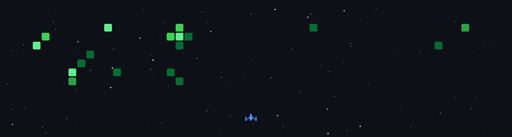

- 🔭 I’m currently working on **Livres App (Church App)**

- 🌱 I’m currently learning **React, React Native** (NO Vibe Coding)

- 👯 I’m looking to collaborate on **React & React Native**

- 📫 How to reach me **leonardopaciellop@gmail.com**

<h3 align="left">Languages and Tools:</h3>

                 

  

